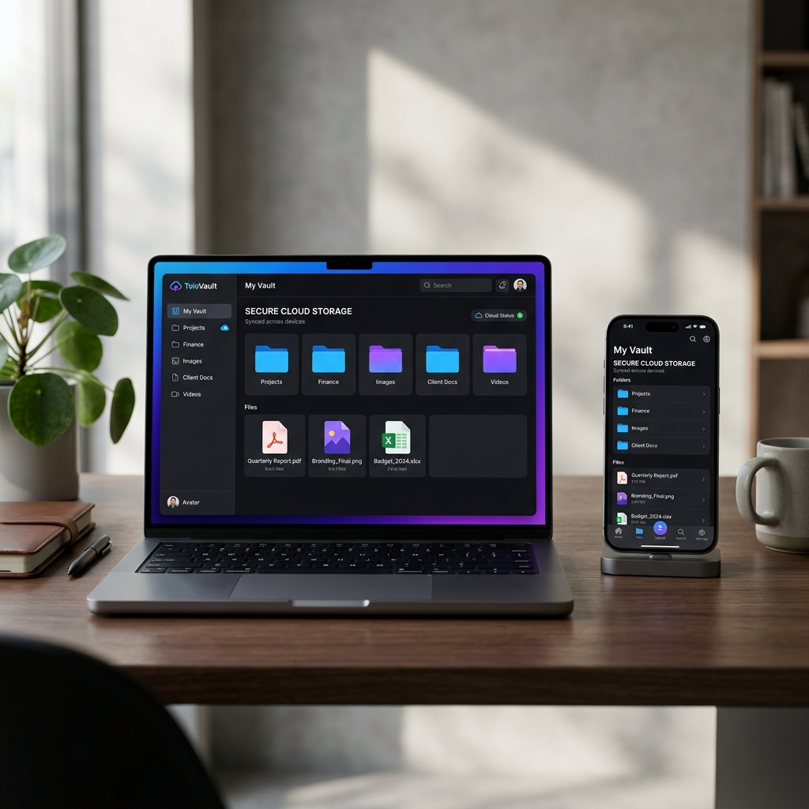

# 🚀 TeleVault — Unlimited Private Cloud Storage via Telegram

**TeleVault** is a lightweight, self-hosted file management system that uses Telegram's infrastructure as an unlimited, encrypted cloud storage backend.

---

## 🌟 Why TeleVault?
Most cloud storage providers limit your space or charge high monthly fees. TeleVault gives you:
*   **♾️ Unlimited Storage**: Leverage Telegram's 2GB per file limit with no total capacity cap.
*   **🔐 Zero-Knowledge Privacy**: Your files are encrypted locally before they ever reach the cloud.
*   **📱 Multi-Device Sync**: Access your files via the Desktop App or any mobile browser.
*   **⚡ High Performance**: Multi-threaded uploads and chunked streaming for large files (movies, archives, etc.).

---

## 💻 Desktop App (Native & Portable)
The recommended way for Windows users. **No technical setup or coding required.**

### **[📥 Download TeleVault v1.0.0 (Windows)](https://github.com/mikasamoto/TeleVault/releases/download/v1.0.0/TeleVault_Windows.zip)**

**Quick Start:**
1.  Extract `TeleVault_Windows.zip`.
2.  Run **`Launch Telegram Storage.vbs`**.
3.  *If Windows warns you, click "More Info" -> "Run Anyway".*

---

## 🌐 Web Edition (For Servers & Laptops)
A standalone Node.js server for advanced users who want to host their own hub.

### **Local Run (Home WiFi)**
1.  Run **`bin/start.bat`**.
2.  Access via `http://localhost:3000`.

### **Global Run (Access Anywhere)**
1.  Run **`bin/setup_online.bat`** (Download tunnel).
2.  Run **`bin/share_online.bat`** (Go online).
3.  Use **`bin/stop_online.bat`** to go offline.

---

## 📈 Discoverability & Community
If you find TeleVault useful, please consider giving it a ⭐! It helps other developers find the project.

---

### 🛡️ Security Note
TeleVault connects directly to Telegram's API. Your bot tokens and encryption keys are stored locally on your machine in `web/data/storage.db`. We never see your data.

---
*TeleVault — Your files, your rules, your cloud.*
